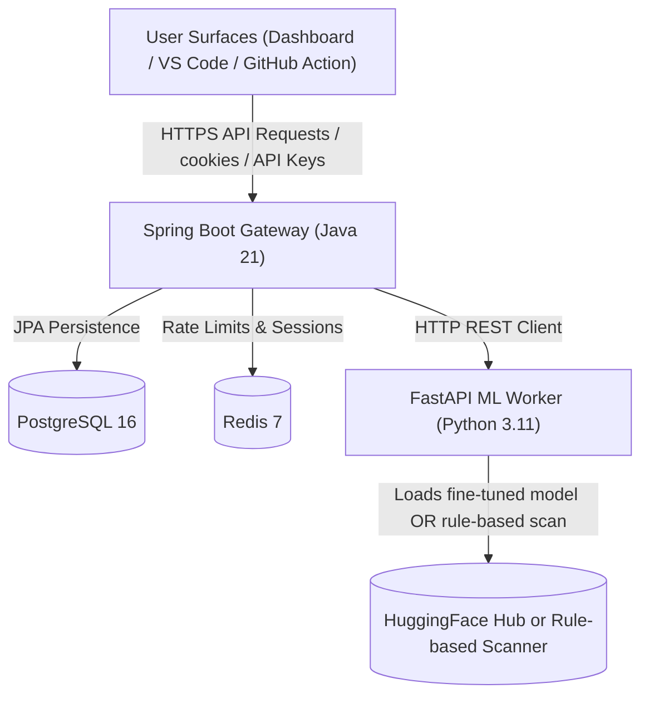
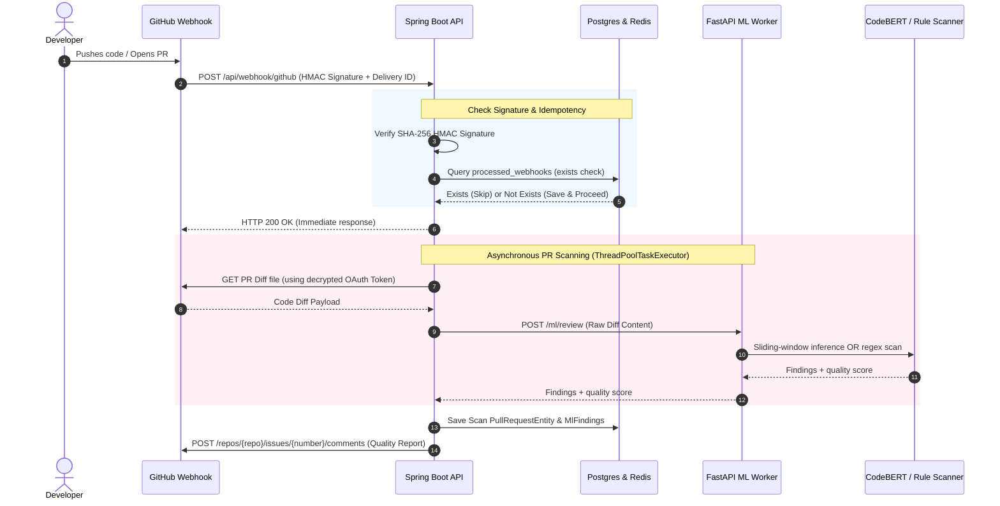

<div align="center" style="background: linear-gradient(135deg, #1e1e3f 0%, #0c0c14 100%); padding: 45px 30px; border-radius: 24px; border: 1px solid #2d2d5a; box-shadow: 0 20px 50px rgba(0, 0, 0, 0.4); margin-bottom: 30px;">
  <h1 style="color: #ffffff; font-family: 'Outfit', sans-serif; font-size: 3.25rem; margin: 0; text-shadow: 0 4px 12px rgba(0,0,0,0.6); font-weight: 800; letter-spacing: -1.5px; border-bottom: none;">automated-code-review-tool 🔍</h1>
  <p style="color: #a0a0d0; font-size: 1.3rem; font-weight: 400; margin-top: 12px; margin-bottom: 25px; font-family: 'Inter', sans-serif; line-height: 1.5;">Multi-Surface Automated Code Review Platform</p>
  <div style="display: flex; justify-content: center; gap: 8px; flex-wrap: wrap;">
    
    
    
    
  </div>
</div>

## What It Does

automated-code-review-tool is a multi-surface automated code review platform. It ingests source
files from a VS Code extension, PR diffs from GitHub webhooks and a GitHub
Action, runs anti-pattern detection through a FastAPI ML worker, and surfaces
inline squiggles, PR comments, and quality scores via a Next.js dashboard.

The three user surfaces are:
- **VS Code Extension** — inline diagnostics on save
- **GitHub Action** — PR review annotations on pull_request events
- **Next.js Web Dashboard** — repo-level quality trends and finding history

The platform ships with two detection engines. A fine-tuned CodeBERT model is
the primary detector; when the model cannot be loaded (for example on
memory-constrained deploys), a rule-based scanner covering the most common
anti-patterns — hardcoded credentials, SQL injection, bare except, sync-in-async
— takes over so the platform remains functional.

---

## Architecture

```
                         ┌──────────────────────────┐
                         │       User Surfaces      │
                         ├──────────────────────────┤
                         │  Next.js Dashboard       │
                         │  VS Code Extension       │
                         │  GitHub Action           │
                         └────────────┬─────────────┘
                                      │ HTTPS
                                      ▼
                         ┌──────────────────────────┐
                         │   Spring Boot API        │
                         │  Java 21 · JWT · JPA     │
                         │  GitHub OAuth · Webhooks │
                         └────┬───────────────┬─────┘
                              │               │
                       JPA    │               │ HTTP (internal)
                              ▼               ▼
                    ┌──────────────────┐  ┌──────────────────┐
                    │  PostgreSQL 16   │  │  FastAPI ML      │
                    │  Redis 7 cache   │  │  Worker          │
                    └──────────────────┘  └────────┬─────────┘
                                                  │
                                                  ▼
                                         ┌──────────────────┐
                                         │  HF Hub / Rules  │
                                         │  (model storage) │
                                         └──────────────────┘
```

### System Topology



---

## Webhook Review & Detection Pipeline

When a developer opens a PR on a connected repository, the system runs the
following end-to-end sequence:



### Pipeline Stages Explained

1. **Authentication & HMAC signature validation.** Every GitHub webhook is
   verified using constant-time SHA-256 HMAC comparisons against the
   repository's registered secret.
2. **Stateful Idempotency.** Webhook deliveries are tracked in Redis and
   PostgreSQL (`processed_webhooks`) keyed on the unique `X-GitHub-Delivery`
   header so replay attacks and redundant model runs are impossible.
3. **Asynchronous Dispatch.** The API immediately returns `200 OK` to
   GitHub. PR diff retrieval and ML worker orchestration run on a configured
   Spring `ThreadPoolTaskExecutor`.
4. **Diff Segmentation & Sliding Window.** Large PR diffs are split into
   512-token windows with a 50-token overlapping stride so they fit inside
   CodeBERT's sequence limit. Per-window logits are aggregated via max-pool.
5. **Model Inference.** The FastAPI worker hosts a CodeBERT-based multi-label
   classifier with six binary heads: `SECURITY`, `PERFORMANCE`,
   `ARCHITECTURE`, `RELIABILITY`, `READABILITY`, and `MAINTAINABILITY`. When
   the model is unavailable, a rule-based fallback scanner returns findings
   for hardcoded credentials, SQL injection, sync I/O in async paths, bare
   except, and quadratic loops.
6. **Reporting.** Findings are persisted, the PR is updated, and a Markdown
   quality report is posted as a comment on the PR.

---

## Tech Stack

| Component        | Language / Technology           | Path                   |
| ---------------- | ------------------------------- | ---------------------- |
| **API**          | Java 21 · Spring Boot 3.3       | `apps/api/`            |
| **Security**     | JWT, OAuth 2.0, HMAC-SHA256     | `apps/api/src/main/java/com/automatedcodereviewtool/security/` |
| **ML Worker**    | Python 3.11 · FastAPI · CodeBERT | `apps/ml-worker/`     |
| **Web Dashboard**| TypeScript · Next.js 15         | `apps/web/`            |
| **VS Code Ext**  | TypeScript · VS Code API        | `apps/vscode-ext/`     |
| **GitHub Action**| TypeScript · @actions/core      | `github-action/`       |
| **Database**     | PostgreSQL 16 · Flyway          | `apps/api/src/main/resources/db/migration/` |
| **Cache / Queue**| Redis 7                         | `apps/api/src/main/resources/` |
| **ML Model Host**| HuggingFace Hub (or rule-based) | configurable via `MODEL_NAME` env var |
| **CI/CD**        | GitHub Actions                  | `.github/workflows/`   |
| **Containerization**| Docker · Render blueprints   | `Dockerfile`, `render.yaml` |

---

## Anti-Pattern Categories

| Category         | Description                                        | Examples                                  |
| ---------------- | -------------------------------------------------- | ----------------------------------------- |
| SECURITY         | Vulnerabilities and credential exposure            | hardcoded API keys, SQL injection, weak crypto |
| PERFORMANCE      | Inefficient data access or computation             | N+1 queries, quadratic loops              |
| ARCHITECTURE     | Structural / module-level smells                   | god classes, circular imports             |
| RELIABILITY      | Failure modes and missing safeguards               | bare except, missing retries, missing timeouts |
| READABILITY      | Naming and structure clarity                       | magic numbers, cryptic names, long methods |
| MAINTAINABILITY  | Code-rot and duplication                           | commented-out code, duplicate logic       |

---

## Quick Start

### Self-host with Docker Compose

```bash
git clone https://github.com/tanmay-alpha/automated-code-review-tool.git
cd automated-code-review-tool
cp .env.example .env          # fill in GITHUB_CLIENT_ID, JWT_SECRET, etc.
docker compose up --build    # postgres, redis, ml-worker, api, web
```

Open `http://localhost:3000` once the web container is healthy.

### Deploy to Render

The repo ships a `render.yaml` blueprint that defines four services:
- `automated-code-review-tool-db` — PostgreSQL 16, Standard plan
- `automated-code-review-tool-redis` — Redis 7, Starter plan
- `automated-code-review-tool-api` — Spring Boot web service, Standard plan
- `automated-code-review-tool-ml-worker` — FastAPI web service, Standard plan

Connect the repo to Render as an "Infrastructure as Code" project and the
four services spin up automatically. Set the `sync: false` env vars
(`JWT_SECRET`, `ENCRYPTION_KEY`, `GITHUB_CLIENT_ID/SECRET`, `HF_TOKEN`,
`ML_WORKER_SECRET`) before the first deploy.

### Connect to Supabase (Production Cloud Database)

To connect the application to **Supabase** PostgreSQL when deployed on Render or locally:
1. Create a project at [Supabase](https://supabase.com).
2. Set `SPRING_DATASOURCE_URL`, `SPRING_DATASOURCE_USERNAME`, and `SPRING_DATASOURCE_PASSWORD` on Render to your Supabase JDBC credentials.
3. Spring Boot's Flyway integration automatically initializes and migrates your Supabase database schema on startup.

See **[SUPABASE_SETUP.md](SUPABASE_SETUP.md)** for the complete integration step-by-step guide.

### Train a CodeBERT model

```bash
cd apps/ml-worker
pip install -r requirements-train.txt

# 1. Generate training data (4k synthetic samples)
python training/generate_training_data.py \
    --output-dir training/data \
    --train-size 4000 --val-size 400 --test-size 400

# 2. Fine-tune on a GPU machine or Colab Pro
python training/train.py \
    --output-dir ./automated-code-review-tool-model \
    --data-dir training/data \
    --model-name microsoft/codebert-base \
    --epochs 5 --batch-size 16 --lr 2e-5 \
    --push-to-hub --hf-repo YOUR_USER/automated-code-review-tool-codebert

# 3. (Optional) Evaluate on the held-out test set
python training/evaluate.py \
    --model-dir ./automated-code-review-tool-model \
    --data-dir training/data \
    --output evaluation_results.json
```

See `apps/ml-worker/training/RUN_TRAINING.md` for the full pipeline.

---

## Evaluation

The evaluation framework is fully implemented. Trained models can be evaluated
on a held-out test set using precision, recall, and macro-F1. See
`apps/ml-worker/training/evaluate.py` and `RUN_TRAINING.md` for the training
pipeline.

| Model                          | Macro-F1 | Precision | Recall | Inference latency (p50) |
| ------------------------------ | -------- | --------- | ------ | ----------------------- |
| CodeBERT fine-tune             | _run evaluate.py_ | _run_ | _run_ | _measure_ |
| Rule-based baseline (regex)    | _run evaluate.py_ | _run_ | _run_ | ~5 ms                   |

> **Honesty note:** The numeric cells are intentionally left blank. The
> training data generator and training pipeline are functional but the
> model has not been trained or benchmarked yet. Populate these cells
> after running `python training/evaluate.py` against a trained checkpoint.
> The README previously contained specific numbers (Macro-F1 0.75, 180 ms
> latency, 50K+ dataset) that were not backed by an evaluation run. Those
> numbers have been removed.

---

## API Reference

### `POST /api/scan/file` — file-level scan (VS Code extension, internal)

```bash
curl -X POST http://localhost:8080/api/scan/file \
  -H "Authorization: Bearer $AUTOMATED_CODE_REVIEW_TOOL_API_KEY" \
  -H "Content-Type: application/json" \
  -d '{
    "content": "for u in users:\n  posts = Post.where(user=u)",
    "language": "python",
    "filePath": "app/services/posts.py"
  }'
# → { "findings": [...], "qualityScore": 62.5 }
```

### `POST /api/auth/api-key/regenerate` — issue a new VS Code key

```bash
curl -X POST http://localhost:8080/api/auth/api-key/regenerate \
  -H "Cookie: automated_code_review_tool_session=$JWT" \
# → { "apiKey": "cl_live_..." }
```

---

## Security Implementation

- **JWT token blacklisting** — secure logout with JTI-based token invalidation
- **OAuth 2.0 integration** — GitHub OAuth with proper error handling
- **API key management** — rotatable API keys with rate limiting
- **HMAC-SHA256 webhook verification** — constant-time signature comparison
- **Sensitive data redaction** — automated filtering of credentials from logs
- **Encrypted storage** — AES-GCM for GitHub OAuth tokens and webhook secrets
- **Container hardening** — non-root users, read-only filesystems, health checks
- **Input validation** — multi-layer validation with bean validation + size limits

---

## Resume Bullet

> Architected automated-code-review-tool, a multi-surface automated code review platform
> featuring a Java 21 / Spring Boot REST API with HMAC-SHA256 webhook
> ingestion, a FastAPI Python service with sliding-window CodeBERT
> anti-pattern classification across six categories, a VS Code extension,
> and a GitHub Action.

---

## License

[MIT](LICENSE) — © 2026 Tanmay Mangal.